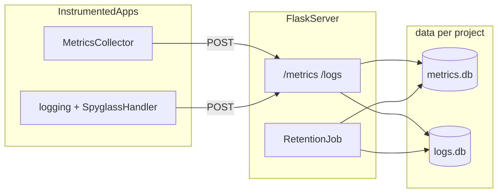

# Spyglass

[](https://github.com/momonala/spyglass/actions/workflows/ci.yml)

Lightweight metrics and log collection for small Python services. Apps emit data through a client SDK; a local Flask server stores raw points in per-project SQLite files under `data/`.

**Last updated:** 2026-05-25 

## What this solves

You need basic observability (counters, gauges, timings, sets, and application logs) without running Datadog or a full metrics stack. Spyglass gives you:

- A **Python SDK** that sends metrics and logs over HTTP (fire-and-forget; failures do not break your app).
- A **single Flask server** that ingests and queries data.
- **Filesystem isolation** per project: `data/{project-slug}/metrics.db` and `logs.db`.

## Prerequisites

- Python 3.12+
- [uv](https://github.com/astral-sh/uv)

## Quick start

Install dependencies and start the server:

```bash
uv sync
uv run spyglass
```

In another terminal, instrument an app (project name is **required**):

```python
from spyglass import initialize

logger, metrics = initialize(host="localhost:5013", project="my-api")

def handle_request():
    metrics.increment("requests")   # → my-api.handle_request.requests
    metrics.gauge("queue_depth", 3)
    with metrics.timed("db_query"):
        ...
    logger.info("handled request")
```

Query stored data:

```bash
curl "http://localhost:5013/metrics?project=my-api&limit=10"
curl "http://localhost:5013/logs?project=my-api&level=INFO"
```

## Local install with uv (one server, many projects)

Run **one Spyglass server** on your machine. Point **each app** at it with a distinct `project` name (that becomes `data/{project-slug}/` on disk).

### 1. Install the server (this repo)

Clone once and install the CLI as a uv tool so `spyglass serve` is available globally:

```bash
git clone <your-spyglass-repo-url> ~/code/spyglass
cd ~/code/spyglass
uv sync
uv tool install --editable .
```

Start the server (uses `[tool.config]` in this repo’s `pyproject.toml`):

```bash
spyglass serve
spyglass --port 5013
```

Leave this running. All instrumented apps send to `http://localhost:5013`.

To upgrade after pulling changes:

```bash
cd ~/code/spyglass && git pull && uv sync && uv tool install --editable --force .
```

### 2. Add the SDK to each application project

In every repo you want to instrument (repeat per project):

```bash
cd ~/code/my-api
uv add --editable ~/code/spyglass
uv sync
```

That adds a path dependency in `pyproject.toml`:

```toml
[project]
dependencies = [
    "spyglass",
]

[tool.uv.sources]
spyglass = { path = "/Users/you/code/spyglass", editable = true }
```

Use the **same path** you cloned to; uv resolves it on `uv sync`.

### 3. Instrument each app with a unique `project`

Each app must pass its own `project` string (not shared across apps):

```python
from spyglass import initialize

logger, metrics = initialize(host="localhost:5013", project="my-api")
```

Examples for several repos:

| Application repo | `project=` value | Data on server |
|------------------|------------------|----------------|
| `~/code/my-api` | `"my-api"` | `data/my-api/` |
| `~/code/worker` | `"worker"` | `data/worker/` |
| `~/code/billing` | `"billing"` | `data/billing/` |

Run the app with uv as usual (`uv run python app.py`, `uv run pytest`, etc.). The SDK is a normal dependency in that environment.

### 4. Verify

```bash
curl http://localhost:5013/status
curl "http://localhost:5013/metrics?project=my-api&limit=5"
```

### Notes

- **Server vs SDK:** `uv tool install` is only for the machine-wide `spyglass serve` command. App repos use `uv add --editable` for imports only; they do not need to run the server themselves.
- **Path dependency:** If you move the spyglass clone, re-run `uv add --editable <new-path>` in each app (or update `[tool.uv.sources]`).
- **Publishing later:** When this package is on PyPI, app repos can use `uv add spyglass` instead of a path source; the instrumentation code stays the same.

## Configuration

Non-secret settings live in `pyproject.toml` under `[tool.config]`:

```toml
[tool.config]
data_dir = "data"       # root for per-project DB directories
host = "0.0.0.0"
port = 5013
retention_days = 30     # default; overridable per project at registration
```

Secrets (optional for v1; reserved for future Flask session use) go in `.env`:

```bash
cp .env.example .env
```

```python
from src.env import FLASK_SECRET_KEY  # loaded via python-dotenv
```

Runtime data under `data/` is gitignored.

Legacy template CLI (project metadata from `pyproject.toml`):

```bash
uv run spyglass-config --project-name
uv run spyglass-config --all
```

## Project structure

```
spyglass/
├── pyproject.toml
├── src/
│   ├── spyglass/
│   │   ├── __init__.py          # MetricsCollector, configure_logging
│   │   ├── cli.py               # spyglass serve
│   │   ├── _config.py           # loads [tool.config]
│   │   ├── client/
│   │   │   ├── collector.py     # metrics SDK
│   │   │   └── logging.py       # SpyglassHandler + configure_logging
│   │   ├── server/
│   │   │   ├── app.py           # Flask factory
│   │   │   ├── routes.py        # ingest/query API
│   │   │   ├── site.py          # dashboard UI + /dashboard/api/*
│   │   │   ├── dashboard_queries.py
│   │   │   └── retention.py     # schedule + background thread
│   │   ├── static/dashboard/    # dashboard HTML/CSS/JS
│   │   └── db/
│   │       ├── models.py        # MetricPoint, LogEntry (timestamp PK)
│   │       └── store.py         # per-project SQLite routing
│   ├── config.py                # legacy Typer config CLI
│   └── env.py                   # .env secrets
├── tests/
└── data/                        # created at runtime (not in git)
    └── {project-slug}/
        ├── metrics.db
        ├── logs.db
        ├── settings.json        # per-project retention_days
        └── dashboard.json       # saved dashboard widgets (optional)
```

## Architecture



**Boundaries:** `spyglass.client` never touches SQLAlchemy. `spyglass.server` routes by `project` and opens the correct DB pair. Retention runs in a daemon thread using `schedule` (hourly, plus once at startup).

**Stat naming:** With default `prefix=True`, `increment("requests")` inside `handle_request` becomes `{project}.handle_request.requests`. Use `prefix=False` to send a full stat name unchanged.

## Client SDK

| Component | Role |
|-----------|------|
| `initialize(host, project, ...)` | Returns `(logger, MetricsCollector)`; logger name matches caller's `__name__` |
| `MetricsCollector(host, project, ...)` | `increment`, `decrement`, `gauge`, `timing`, `set`, `timed()` context manager |
| `configure_logging(host, project, ...)` | `basicConfig` to stdout + remote `SpyglassHandler` (used by `initialize`) |

`project` must be a non-empty string; there is no auto-discovery from `pyproject.toml`.

Network errors are logged and swallowed so instrumentation never raises into application code.

## HTTP API

Base URL: `http://{host}:{port}` (default `5013`).

| Endpoint | Method | Description |
|----------|--------|-------------|
| `/status` | GET | Liveness |
| `/projects/register` | POST | Register project + `retention_days` |
| `/metrics` | POST | Ingest metric point(s) |
| `/logs` | POST | Ingest log entry/entries |
| `/metrics` | GET | Query metrics (`project` required) |
| `/logs` | GET | Query logs (`project` required) |

**Register project:**

```bash
curl -X POST http://localhost:5013/projects/register \
  -H "Content-Type: application/json" \
  -d '{"project": "my-api", "retention_days": 30}'
```

**Ingest metric (single point):**

```bash
curl -X POST http://localhost:5013/metrics \
  -H "Content-Type: application/json" \
  -d '{
    "project": "my-api",
    "name": "my-api.handle_request.requests",
    "metric_type": "counter",
    "value": 1
  }'
```

**Query metrics:**

```bash
curl "http://localhost:5013/metrics?project=my-api&metric_type=counter&limit=100"
```

GET query params: `name` (prefix), `metric_type`, `from`, `to`, `limit`. Logs support `level`, `from`, `to`, `limit`.

## Building dashboards

Spyglass is the source of truth for UI. It ships two CSS files that any app can consume:

| File | What it contains |
|------|-----------------|
| `shared.css` | CSS custom properties only — colors, radius, shadows, typography tokens |
| `components.css` | Generic UI building blocks — `.card`, `.stat`, `.btn`, `.field`, `.level-badge`, `.data-table` |

### Embedding in another app

Link both files from the running Spyglass server, then your own app styles last:

```html
<link rel="stylesheet" href="http://localhost:5013/dashboard/static/css/shared.css">
<link rel="stylesheet" href="http://localhost:5013/dashboard/static/css/components.css">
<link rel="stylesheet" href="/static/your-app.css">
```

Use spyglass token names directly in your CSS — no translation layer:

```css
/* your-app.css */
:root {
  --accent: #bf5af2;   /* override the default blue with your app's tint */
}

.my-section {
  background: var(--surface-raised);
  border: 0.5px solid var(--separator);
  border-radius: var(--radius-lg);
  color: var(--label-secondary);
}
```

Use component classes directly in HTML:

```html
<div class="card">
  <div class="card-header">
    <h2 class="card-title">Requests</h2>
    <p class="card-subtitle">Last 24 hours</p>
  </div>
  <div class="stat-grid">
    <div class="stat">
      <span class="stat-label">Total</span>
      <span class="stat-value stat-healthy">4,821</span>
    </div>
    <div class="stat">
      <span class="stat-label">Errors</span>
      <span class="stat-value stat-danger">12</span>
    </div>
  </div>
</div>

<button class="btn btn--primary">Refresh</button>

<span class="level-badge level-warning">WARNING</span>
```

### Available tokens (shared.css)

| Token | Purpose |
|-------|---------|
| `--bg`, `--surface`, `--surface-raised` | Background layers (darkest → lightest) |
| `--fill`, `--fill-hover` | Interactive fill for buttons and form controls |
| `--label`, `--label-secondary`, `--label-tertiary` | Text hierarchy |
| `--accent`, `--danger`, `--success`, `--warning` | Semantic tints |
| `--accent-soft`, `--danger-soft` | Translucent tint fills |
| `--separator`, `--separator-opaque` | Borders and dividers |
| `--shadow-sm/md/lg` | Elevation shadows |
| `--radius-sm/md/lg/xl` | Border radii (8 → 20px) |
| `--font-sans`, `--font-mono` | Font stacks |

### Available components (components.css)

| Class | Notes |
|-------|-------|
| `.card` | Surface card with border + shadow |
| `.card-header`, `.card-title`, `.card-subtitle` | Card header section |
| `.stat-grid` | 2-column responsive stat layout |
| `.stat`, `.stat-label`, `.stat-value` | Individual stat tile |
| `.stat-healthy`, `.stat-warn`, `.stat-danger` | Semantic value colors |
| `.level-badge` + `.level-{debug\|info\|warning\|error\|critical}` | Log level pill |
| `.btn`, `.btn--primary`, `.btn--ghost` | Button variants |
| `.field` | Labeled vertical form control (wraps `<select>` or `<input>`) |
| `.status-banner`, `.status-banner--error` | Inline status message |
| `.empty-state` | Centered empty-state paragraph |
| `.table-wrap`, `.data-table` | Scrollable table with styled headers |

### What not to do

**Don't copy tokens into your app.** If you define your own `--surface: #1c1c1e`, you lose updates and create drift. Link `shared.css` and override only what genuinely differs.

**Don't create a token bridge.** Mapping `--color-bg: var(--bg)` is noise. Use `var(--bg)` directly.

**Don't import `dashboard.css`.** That file is Spyglass-internal — it styles the widget grid, toolbar, and modal that only exist in `/dashboard`. It is not a consumer API.

**Don't put domain logic in Spyglass CSS.** Health banner states, chart container sizing, log table columns — those belong in your app's own stylesheet. Only push something to `components.css` if it is genuinely reusable across projects.

**Don't override component internals.** Restyle at the token level: override `--accent` or `--radius-xl` in your `:root`, not `.btn { border-radius: 4px }`.

---

## Dashboard

Start the server and open the dashboard in your browser:

```bash
uv run spyglass serve
# http://localhost:5013/dashboard
```

The dashboard UI is served separately from the ingest/query API:

| Module | Role |
|--------|------|
| [`routes.py`](src/spyglass/server/routes.py) | SDK ingest and raw query API (`/metrics`, `/logs`) |
| [`site.py`](src/spyglass/server/site.py) | Dashboard HTML/static assets and `/dashboard/api/*` |
| [`dashboard_queries.py`](src/spyglass/server/dashboard_queries.py) | Aggregations and layout persistence |

**Features (v1):**

- Project selector (populated from directories under `data/`)
- Reusable widgets: time series, counter, histogram
- Add/remove widgets; explicit **Save** writes layout to disk
- Time range presets: 1h, 6h, 24h, all

**Layout file:** `data/{project-slug}/dashboard.json`

**Dashboard API (prefix `/dashboard/api`):**

| Endpoint | Description |
|----------|-------------|
| `GET /projects` | List projects |
| `GET /metrics/names?project=` | Distinct metric names/types |
| `GET /metrics/series?project=&name=&from=&to=` | Bucketed time series |
| `GET /metrics/summary?project=&name=&from=&to=` | Latest value / window sum |
| `GET /metrics/histogram?project=&name=&from=&to=` | Timing distribution |
| `GET /layout?project=` | Load saved widgets |
| `PUT /layout?project=` | Save widget layout |

**Adding a widget type:** create a module under [`static/dashboard/js/components/`](src/spyglass/static/dashboard/js/components/), register it in `registry.js`, and add the type to `ALLOWED_WIDGET_TYPES` in `dashboard_queries.py`.

## Data model

Both tables use **`timestamp` as the primary key** (UTC, naive in SQLite).

**`metric_points`** (`metrics.db`): `timestamp`, `name`, `metric_type` (see `MetricType` in `spyglass.db.models`), `value`, `tags` (JSON text).

**`log_entries`** (`logs.db`): `timestamp`, `level`, `logger_name`, `message`, `extra` (JSON text).

Retention deletes rows older than each project's `retention_days` from `data/{slug}/settings.json`, scanning all project directories every hour.

## Development

```bash
uv sync
uv run pytest tests/
uv run ruff check src/spyglass/ tests/
```
