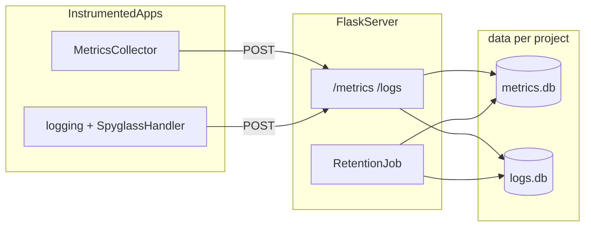

# Spyglass

[](https://github.com/momonala/spyglass/actions/workflows/ci.yml)

Lightweight metrics and log collection for small Python services. Apps emit data through a client SDK; a local Flask server stores raw points in per-project SQLite files under `data/`.

**Last updated:** 2026-05-25 

## What this solves

You need basic observability (counters, gauges, timings, sets, and application logs) without running Datadog or a full metrics stack. Spyglass gives you:

- A **Python SDK** that sends metrics and logs over HTTP (fire-and-forget; failures do not break your app).
- A **single Flask server** that ingests and queries data.
- **Filesystem isolation** per project: `data/{project-slug}/metrics.db` and `logs.db`.

## Prerequisites

- Python 3.12+
- [uv](https://github.com/astral-sh/uv)

## Quick start

Install dependencies and start the server:

```bash
uv sync
uv run spyglass
```

In another terminal, instrument an app (project name is **required**):

```python
from spyglass import initialize

logger, metrics = initialize(host="localhost:5013", project="my-api")

def handle_request():
    metrics.increment("requests")   # → my-api.handle_request.requests
    metrics.gauge("queue_depth", 3)
    with metrics.timed("db_query"):
        ...
    logger.info("handled request")
```

Query stored data:

```bash
curl "http://localhost:5013/metrics?project=my-api&limit=10"
curl "http://localhost:5013/logs?project=my-api&level=INFO"
```

## Local install with uv (one server, many projects)

Run **one Spyglass server** on your machine. Point **each app** at it with a distinct `project` name (that becomes `data/{project-slug}/` on disk).

### 1. Install the server (this repo)

Clone once and install the CLI as a uv tool so `spyglass serve` is available globally:

```bash
git clone <your-spyglass-repo-url> ~/code/spyglass
cd ~/code/spyglass
uv sync
uv tool install --editable .
```

Start the server (uses `[tool.config]` in this repo’s `pyproject.toml`):

```bash
spyglass serve
spyglass --port 5013
```

Leave this running. All instrumented apps send to `http://localhost:5013`.

To upgrade after pulling changes:

```bash
cd ~/code/spyglass && git pull && uv sync && uv tool install --editable --force .
```

### 2. Add the SDK to each application project

In every repo you want to instrument (repeat per project):

```bash
cd ~/code/my-api
uv add --editable ~/code/spyglass
uv sync
```

That adds a path dependency in `pyproject.toml`:

```toml
[project]
dependencies = [
    "spyglass",
]

[tool.uv.sources]
spyglass = { path = "/Users/you/code/spyglass", editable = true }
```

Use the **same path** you cloned to; uv resolves it on `uv sync`.

### 3. Instrument each app with a unique `project`

Each app must pass its own `project` string (not shared across apps):

```python
from spyglass import initialize

logger, metrics = initialize(host="localhost:5013", project="my-api")
```

Examples for several repos:

| Application repo | `project=` value | Data on server |
|------------------|------------------|----------------|
| `~/code/my-api` | `"my-api"` | `data/my-api/` |
| `~/code/worker` | `"worker"` | `data/worker/` |
| `~/code/billing` | `"billing"` | `data/billing/` |

Run the app with uv as usual (`uv run python app.py`, `uv run pytest`, etc.). The SDK is a normal dependency in that environment.

### 4. Verify

```bash
curl http://localhost:5013/status
curl "http://localhost:5013/metrics?project=my-api&limit=5"
```

### Notes

- **Server vs SDK:** `uv tool install` is only for the machine-wide `spyglass serve` command. App repos use `uv add --editable` for imports only; they do not need to run the server themselves.
- **Path dependency:** If you move the spyglass clone, re-run `uv add --editable <new-path>` in each app (or update `[tool.uv.sources]`).
- **Publishing later:** When this package is on PyPI, app repos can use `uv add spyglass` instead of a path source; the instrumentation code stays the same.

## Configuration

Non-secret settings live in `pyproject.toml` under `[tool.config]`:

```toml
[tool.config]
data_dir = "data"       # root for per-project DB directories
host = "0.0.0.0"
port = 5013
retention_days = 30     # default; overridable per project at registration
```

Secrets (optional for v1; reserved for future Flask session use) go in `.env`:

```bash
cp .env.example .env
```

```python
from src.env import FLASK_SECRET_KEY  # loaded via python-dotenv
```

Runtime data under `data/` is gitignored.

Legacy template CLI (project metadata from `pyproject.toml`):

```bash
uv run spyglass-config --project-name
uv run spyglass-config --all
```

## Project structure

```
spyglass/
├── pyproject.toml
├── src/
│   ├── spyglass/
│   │   ├── __init__.py          # MetricsCollector, configure_logging
│   │   ├── cli.py               # spyglass serve
│   │   ├── _config.py           # loads [tool.config]
│   │   ├── client/
│   │   │   ├── collector.py     # metrics SDK
│   │   │   ├── logging.py       # SpyglassHandler + configure_logging
│   │   │   └── query.py         # SpyglassQueryClient
│   │   ├── dashboard/
│   │   │   ├── aggregate.py     # TimeWindow, counter_series, timing_*, etc.
│   │   │   ├── builder.py       # SummaryBuilder — high-level aggregation
│   │   │   ├── config.py        # MetricSelector, ChartDefinition, StateTransitionRule
│   │   │   └── schemas.py       # SummaryResponse and related types
│   │   ├── server/
│   │   │   ├── app.py           # Flask factory
│   │   │   ├── routes.py        # ingest/query API
│   │   │   └── retention.py     # schedule + background thread
│   │   └── db/
│   │       ├── models.py        # MetricPoint, LogEntry (timestamp PK)
│   │       └── store.py         # per-project SQLite routing
│   ├── config.py                # legacy Typer config CLI
│   └── env.py                   # .env secrets
├── tests/
└── data/                        # created at runtime (not in git)
    └── {project-slug}/
        ├── metrics.db
        ├── logs.db
        └── settings.json        # per-project retention_days
```

## Architecture



**Boundaries:** `spyglass.client` never touches SQLAlchemy. `spyglass.server` routes by `project` and opens the correct DB pair. Retention runs in a daemon thread using `schedule` (hourly, plus once at startup).

**Stat naming:** With default `prefix=True`, `increment("requests")` inside `handle_request` becomes `{project}.handle_request.requests`. Use `prefix=False` to send a full stat name unchanged.

## Client SDK

| Component | Role |
|-----------|------|
| `initialize(host, project, ...)` | Returns `(logger, MetricsCollector)`; logger name matches caller's `__name__` |
| `MetricsCollector(host, project, ...)` | `increment`, `decrement`, `gauge`, `timing`, `set`, `timed()` context manager |
| `configure_logging(host, project, ...)` | `basicConfig` to stdout + remote `SpyglassHandler` (used by `initialize`) |

`project` must be a non-empty string; there is no auto-discovery from `pyproject.toml`.

Network errors are logged and swallowed so instrumentation never raises into application code.

## HTTP API

Base URL: `http://{host}:{port}` (default `5013`).

| Endpoint | Method | Description |
|----------|--------|-------------|
| `/status` | GET | Liveness |
| `/projects/register` | POST | Register project + `retention_days` |
| `/metrics` | POST | Ingest metric point(s) |
| `/logs` | POST | Ingest log entry/entries |
| `/metrics` | GET | Query metrics (`project` required) |
| `/logs` | GET | Query logs (`project` required) |

**Register project:**

```bash
curl -X POST http://localhost:5013/projects/register \
  -H "Content-Type: application/json" \
  -d '{"project": "my-api", "retention_days": 30}'
```

**Ingest metric (single point):**

```bash
curl -X POST http://localhost:5013/metrics \
  -H "Content-Type: application/json" \
  -d '{
    "project": "my-api",
    "name": "my-api.handle_request.requests",
    "metric_type": "counter",
    "value": 1
  }'
```

**Query metrics:**

```bash
curl "http://localhost:5013/metrics?project=my-api&metric_type=counter&limit=100"
```

GET query params: `name` (prefix), `metric_type`, `from`, `to`, `limit`. Logs support `level`, `from`, `to`, `limit`.

## Building dashboards

Spyglass is headless — it provides no hosted UI. Consumer apps fetch raw data via `SpyglassQueryClient` and use the `spyglass.dashboard` Python library to aggregate it before rendering their own views.

### Fetching data

`SpyglassQueryClient` wraps the HTTP API with typed helpers:

```python
from spyglass.client.query import SpyglassQueryClient
from datetime import datetime, timezone, timedelta

client = SpyglassQueryClient(host="localhost:5013", project="my-api")

since = datetime.now(timezone.utc) - timedelta(hours=6)
metrics = client.fetch_metrics(since=since)   # list[dict]
logs    = client.fetch_logs(since=since)       # list[dict]
```

### Aggregating with SummaryBuilder

`SummaryBuilder` is the high-level entry point. Configure it once, call `build()` per request:

```python
from spyglass.dashboard.builder import SummaryBuilder
from spyglass.dashboard.config import MetricSelector, ChartDefinition, ChartSeries, StateTransitionRule

builder = SummaryBuilder(
    selectors={
        "requests": MetricSelector(".requests", metric_type="counter"),
        "latency":  MetricSelector(".latency",  metric_type="timing"),
        "queue":    MetricSelector(".queue_depth", metric_type="gauge"),
        "healthy":  MetricSelector(".healthy",  metric_type="counter"),
        "degraded": MetricSelector(".degraded", metric_type="counter"),
    },
    state_rules=[
        StateTransitionRule("healthy",  "healthy"),
        StateTransitionRule("degraded", "degraded"),
    ],
    charts=[
        ChartDefinition("throughput", series=[ChartSeries("reqs", "requests", metric_type="counter")]),
        ChartDefinition("latency_p50", series=[ChartSeries("p50", "latency", metric_type="timing")]),
    ],
    states=["healthy", "degraded", "unknown"],
)

summary = builder.build(metrics, logs, window_amount=6, window_unit="hours", rollup="15")
# summary.counters, summary.timings, summary.gauges, summary.charts, summary.state, summary.logs
```

### Using aggregate functions directly

For lower-level control, use `spyglass.dashboard.aggregate` directly:

```python
from spyglass.dashboard.aggregate import (
    TimeWindow, counter_series, timing_p50_series,
    counter_sum, timing_summary, latest_gauge,
    build_log_histogram, compute_state_uptime,
    ratio_series,
)
from datetime import datetime, timezone

now = datetime.now(timezone.utc)
window = TimeWindow.from_hours(6, now, rollup_minutes=15)

total_requests  = counter_sum(metrics, ".requests")
latency         = timing_summary(metrics, ".latency")   # .count, .p50, .p95, .max
queue_depth     = latest_gauge(metrics, ".queue_depth")
series          = counter_series(metrics, ".requests", window)  # list[float] per bucket
p50_series      = timing_p50_series(metrics, ".latency", window)
log_hist        = build_log_histogram(prepare_logs(logs), window)
```

### Wiring into your Flask app

A typical pattern — expose an `/api/observability/summary` endpoint your frontend calls:

```python
from flask import jsonify
from spyglass.client.query import SpyglassQueryClient
from datetime import datetime, timezone, timedelta

client = SpyglassQueryClient(host="localhost:5013", project="my-api")

@app.get("/api/observability/summary")
def observability_summary():
    since = datetime.now(timezone.utc) - timedelta(hours=6)
    metrics = client.fetch_metrics(since=since)
    logs    = client.fetch_logs(since=since)
    summary = builder.build(metrics, logs)
    return jsonify(summary.__dict__)
```

## Data model

Both tables use **`timestamp` as the primary key** (UTC, naive in SQLite).

**`metric_points`** (`metrics.db`): `timestamp`, `name`, `metric_type` (see `MetricType` in `spyglass.db.models`), `value`, `tags` (JSON text).

**`log_entries`** (`logs.db`): `timestamp`, `level`, `logger_name`, `message`, `extra` (JSON text).

Retention deletes rows older than each project's `retention_days` from `data/{slug}/settings.json`, scanning all project directories every hour.

## Development

```bash
uv sync
uv run pytest tests/
uv run ruff check src/spyglass/ tests/
```
